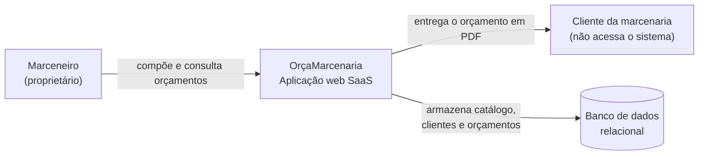
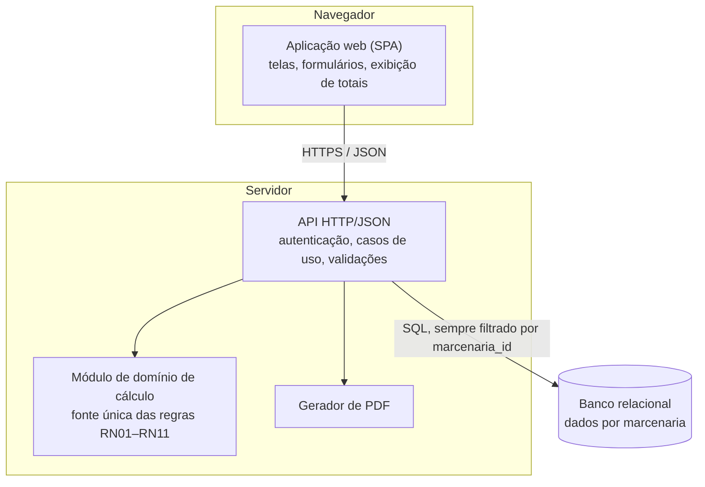
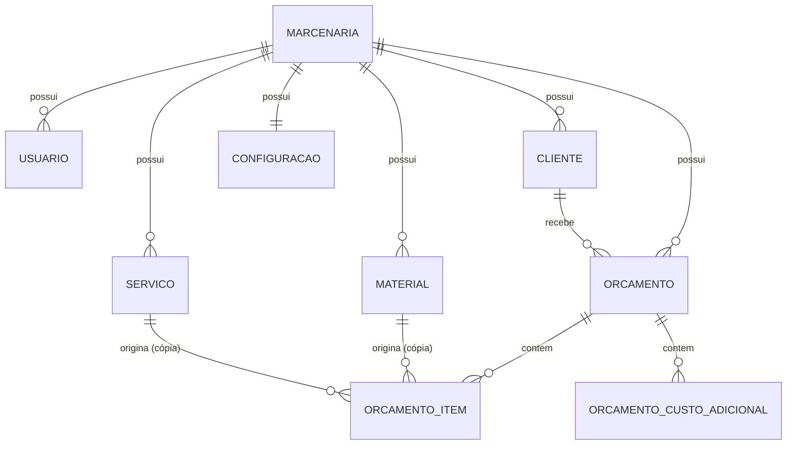
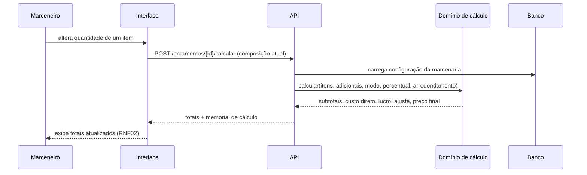

# Arquitetura

Versão 1.0 · Descreve a arquitetura pretendida e o modelo de dados. Conforme a orientação da ata, a stack é apresentada como **direção de pesquisa**: os critérios de escolha estão em §6 e a decisão final, quando confirmada, é registrada em `decisoes.md`.

## 1. Visão de contexto (C4 — nível 1)



O sistema não possui integrações externas no MVP: sem gateway de pagamento, sem emissor fiscal, sem consulta a preços de fornecedor. Essa ausência é deliberada e sustenta o recorte do TCC.

## 2. Visão de contêineres (C4 — nível 2)



**Regra arquitetural central (RNF08):** o cálculo do orçamento existe em **um único lugar** — o módulo de domínio no servidor. A interface nunca calcula preço por conta própria; ela envia a composição e exibe os totais devolvidos. Isso garante que o valor testado, o valor exibido e o valor impresso no PDF sejam sempre o mesmo número, o que é pré-requisito da validação do TCC.

## 3. Camadas do servidor

| Camada | Responsabilidade | Não faz |
|---|---|---|
| Rotas / controladores | Receber requisição, autenticar, validar formato, devolver resposta | Regra de negócio |
| Casos de uso | Orquestrar: buscar dados, chamar o domínio, persistir, registrar | SQL bruto espalhado |
| Domínio (cálculo) | Aplicar RN01–RN11 sobre valores já carregados; função pura, sem banco | Acessar banco ou HTTP |
| Repositórios | Acesso a dados, sempre com `marcenaria_id` no filtro | Decidir preço |

O domínio ser uma função pura é o que torna possível testá-lo com os dez casos da proposta sem subir banco nem interface.

## 4. Multi-tenant simples

- Toda tabela de negócio possui `marcenaria_id`.
- O `marcenaria_id` vem **sempre da sessão autenticada**, nunca de campo enviado pelo cliente.
- Repositórios aplicam o filtro por padrão; consulta sem filtro é defeito grave (RNF12).
- Teste obrigatório de isolamento: usuário da marcenaria A solicita, por ID direto, um registro da marcenaria B e deve receber "não encontrado" (não "acesso negado", para não revelar a existência do registro).
- Um usuário pertence a exatamente uma marcenaria. Múltiplos usuários por conta e múltiplas contas por usuário estão fora do escopo (§6.2 de `contexto-e-escopo.md`).

## 5. Modelo de dados



### 5.1 Tabelas

**marcenaria** — `id`, `nome`, `responsavel`, `cnpj?`, `telefone?`, `email_contato?`, `endereco?`, `criado_em`

**usuario** — `id`, `marcenaria_id`, `nome`, `email` (único), `senha_hash`, `ativo`, `criado_em`

**configuracao** — `marcenaria_id` (PK), `modo_lucro` (`margem` | `markup`), `percentual_lucro_padrao` NUMERIC(5,2), `regra_arredondamento` (`duas_casas` | `real_inteiro` | `dezena`), `validade_padrao_dias` INT

**cliente** — `id`, `marcenaria_id`, `nome`, `telefone?`, `email?`, `endereco?`, `ativo`, `criado_em`

**material** — `id`, `marcenaria_id`, `nome` (único por marcenaria, inclusive entre inativos), `descricao?` (até 300), `unidade` (`un`, `m`, `m²`, `ml`, `ch`, `kg`, `L`, `pç`), `custo_unitario` NUMERIC(12,4), `ativo`, `criado_em`, `atualizado_em`

**servico** — `id`, `marcenaria_id`, `nome` (único por marcenaria, inclusive entre inativos), `descricao?` (até 300), `tipo_cobranca` (`hora` | `unidade`), `valor_unitario` NUMERIC(12,4), `ativo`, `criado_em`, `atualizado_em`

**orcamento** — `id`, `marcenaria_id`, `numero` INT, `cliente_id`, `descricao_projeto`, `data_emissao`, `data_validade`, `situacao`, `modo_lucro`, `percentual_lucro` NUMERIC(5,2), `regra_arredondamento`, `subtotal_materiais` NUMERIC(12,2), `subtotal_servicos` NUMERIC(12,2), `total_adicionais` NUMERIC(12,2), `custo_direto_total` NUMERIC(12,2), `valor_lucro` NUMERIC(12,2), `ajuste_arredondamento` NUMERIC(12,2), `preco_final` NUMERIC(12,2), `observacoes?`, `criado_em`, `atualizado_em`
- Único: (`marcenaria_id`, `numero`)

**orcamento_item** — `id`, `orcamento_id`, `tipo` (`material` | `servico`), `material_id?`, `servico_id?`, `descricao`, `unidade`, `quantidade` NUMERIC(12,3), `valor_unitario` NUMERIC(12,4), `valor_linha` NUMERIC(12,2), `valor_ajustado_manualmente` BOOL, `ordem` INT

**orcamento_custo_adicional** — `id`, `orcamento_id`, `descricao`, `valor` NUMERIC(12,2), `ordem` INT

### 5.2 Decisões de modelagem

1. **Valores congelados no item** (RN08): `descricao`, `unidade` e `valor_unitario` são copiados do catálogo. `material_id`/`servico_id` ficam apenas como referência de origem e podem apontar para registro inativo.
2. **Totais persistidos no orçamento**, além de calculáveis: o orçamento é um documento histórico: precisa reproduzir o valor entregue ao cliente mesmo que a regra do sistema mude depois. Ao registrar, os totais são gravados; ao reabrir um rascunho, são recalculados.
3. **`modo_lucro`, `percentual_lucro` e `regra_arredondamento` copiados da configuração para o orçamento**: alterar a configuração da marcenaria não pode reescrever a história de orçamentos passados.
4. **Exclusão lógica** (`ativo`) em todo cadastro (RNF10).
5. **Numeração por marcenaria** e não global, para que o cliente veja "Orçamento nº 12" e não um identificador do sistema.

## 6. Stack — direção de pesquisa e critérios

Stack confirmada em 2026-09-02 (D007), na direção indicada pela proposta:

| Camada | Escolha | Observação |
|---|---|---|
| Front-end | React com TypeScript (Vite) | Projeto separado em `frontend/`; não calcula preço |
| Back-end | Node.js com TypeScript | Projeto separado em `backend/`; concentra o domínio de cálculo |
| Banco | PostgreSQL | Tipo `NUMERIC` nativo, exigido por RNF07 |
| PDF | Biblioteca de geração no servidor | Escolha da biblioteca fica para o incremento 006 |
| Testes | Framework de testes do ecossistema Node/TypeScript | Definido no incremento 000 |
| Versionamento | Git + GitHub | — |
| Editor / harness | Visual Studio Code + Claude Code | Skills do projeto em `.claude/skills/` |

**Critérios que sustentaram a escolha:** domínio prévio da autora; gratuidade das ferramentas; documentação disponível; compatibilidade com hospedagem em VPS; suporte a decimal exato; execução local sem custo.

> Bibliotecas específicas (PDF, validação, acesso a banco, framework de teste) permanecem em aberto e são decididas no incremento em que forem necessárias, com registro em `decisoes.md`.

## 7. Estrutura de diretórios pretendida

```
projeto/
├── README.md · AGENTS.md · ESTADO_ATUAL.md · HANDOFF.md · BLOQUEIOS.md
├── .claude/skills/            # rotinas reutilizáveis: abrir-incremento, verificar-calculo, fechar-spec
├── .vscode/                   # configuração compartilhada do editor
├── documentacao/              # fonte de verdade do projeto
│   ├── contexto-e-escopo.md · requisitos.md · historias-de-usuario.md
│   ├── regras-de-calculo.md · arquitetura.md · qualidade-e-testes.md
│   ├── decisoes.md · roadmap.md · roteiro-entrevista.md
│   └── fontes/                # proposta, ata e metodologia originais (.docx)
├── specs/                     # um diretório por incremento, criado pelo fluxo do Spec Kit
├── backend/
│   ├── src/
│   │   ├── dominio/orcamento/ # cálculo puro (RN01–RN11) — implementação única
│   │   ├── casos-de-uso/
│   │   ├── infra/             # banco, repositórios, PDF
│   │   ├── api/               # rotas e middlewares
│   │   └── config/
│   ├── migracoes/ · seeds/
│   └── tests/unidade/ · tests/integracao/
├── frontend/
│   ├── src/                   # paginas, componentes, servicos, hooks, estilos, tipos
│   └── public/
└── evidencias/                # testes, entrevista e avaliação de uso
```

## 8. Fluxo do cálculo (sequência)



O mesmo módulo `D` é chamado no registro do orçamento, na geração do PDF e nos testes automatizados — nunca há um segundo caminho de cálculo.

## 9. Riscos arquiteturais

| Risco | Impacto | Mitigação |
|---|---|---|
| Uso de ponto flutuante em alguma camada gera centavos de diferença | Reprova o critério central do TCC (RNF06) | Tipo decimal do banco à interface; teste automatizado de precisão; front-end nunca recalcula |
| Falta de filtro por marcenaria em uma consulta | Vazamento entre contas | Filtro no repositório base + teste de isolamento em cada Spec que cria consulta |
| Escopo crescer durante o desenvolvimento | Não conclusão no prazo (R1) | Toda nova ideia vira item de roadmap, nunca implementação direta (regra da metodologia) |
| Ferramenta de PDF de configuração complexa | Atraso no incremento 006 | Avaliar biblioteca antes de abrir a Spec; alternativa de impressão via navegador registrada como plano B |
| Dependência de disponibilidade do proprietário para entrevista e avaliação | Atraso em OE1 e OE7 | Agendar com antecedência; registrar em `BLOQUEIOS.md` |
